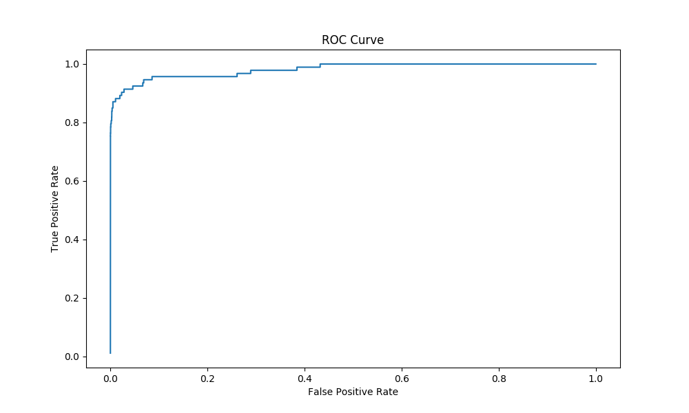

# 资产预测模型
## 模型的检验
模型检验保证**客观严谨**。
### 数据集的划分
为了保证实验的可重复性性，在考虑到数据本身就是乱序的情况下，对测试集合和训练集合采取了固定比例划分。并且在划分前没有进行顺序的打乱，确保所有实验可重复性。

由于比例悬殊，先把分类为1和0的数据进行了分类。并设置20%的数据为为训练集。数据0,1处理分类和80组预测数据分类的处理见deal_data.py文件。

- 值得注意的是，之后所有的数据扩增等操作可能的预处理均是在训练集上进行的，测试集在划分之后就仅仅供检测使用，而不是有些做法先将数据进行扩增等预处理，再划分测试集。

- 数据的处理：编写了数据的类，提供了多种接口，在Data.py中

## 模型检验 
模型的检验第一问采用AUC，第二问采用平均相对误差
### AUC检验

auc:0.9813,直接运行Judge函数即可得到，图片保存成了图片，因为远程调试无法显示图片。

### 平均相对误差
所有测试的值已经保存成了excel,最后一列为预测值。文件已经上传到github

## 运行环境
### GPU版本
测试环境 CUDA 8.0 + python3.6 + ubuntun + TITAN XP 

文件为:Judge.py Predict.py

### CPU版本
CPU和GPU版本有些不同，单根内存小在测试所有测试集合的时候似乎会爆内存。

